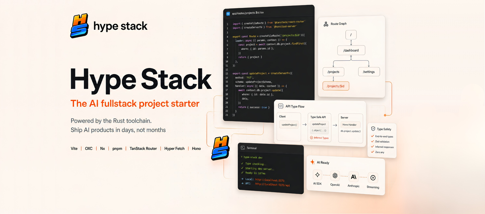

<h1 align="center">



</h1>

<h3 align="center">The starting point for web + desktop apps.<br/>Fully typed. AI-ready. Production-grade architecture.</h3>

<p align="center">
A clean, empty full-stack template.<br/>
Add features as you need them — one command at a time.
</p>

<h3 align="center">Get started:</h3>

```bash
npx @hype-stack/cli create
```

&nbsp;

## What Is Hype Stack?

Hype Stack is a **modern full-stack template** — not a boilerplate packed with someone else's opinions. You get a clean, empty project with rock-solid architecture and tooling already wired up. No demo features to rip out. No dead code to clean up.

Build whatever you want from day one.

&nbsp;

## How It Works

Hype Stack follows the same model as [shadcn/ui](https://ui.shadcn.com) — but for full-stack features.

1. **Scaffold** your project with the CLI
2. **Add packs** when you need them — auth, orgs, realtime, storage, desktop, and more
3. Each pack drops production-ready code **into your codebase** — you own it, you modify it

```bash
npx @hype-stack/cli create          # Create a new project
npx @hype-stack/cli add auth        # Add authentication pack
npx @hype-stack/cli add orgs        # Add organizations & RBAC pack
```

No lock-in. No runtime dependency. Just code in your repo.

&nbsp;

## Preview

<!-- TODO: Add a GIF or screenshot of the running app here -->
<!-- Suggested: dashboard view, login screen, or desktop app window -->


&nbsp;

<p align="center">
	<a href="https://github.com/sponsors/prc5?tier=Platinum">
		<picture>
			
		</picture>
	</a>
</p>

<p align="center">
	<a href="https://github.com/sponsors/prc5?tier=Platinum">
		<picture>
			
		</picture>
	</a>
</p>

## What You Get Out of the Box

The template ships with **zero features** and **everything you need to build them**:

- **Monorepo** — frontend, backend, and shared packages in one repo
- **End-to-end types** — frontend imports backend contracts directly, no codegen
- **Rust-powered tooling** — OXC linting, formatting, Vite 8 HMR in milliseconds
- **AI-native structure** — vertical architecture with Cursor rules and agent skills
- **Desktop-ready** — Electron Forge pre-configured for macOS, Windows, and Linux
- **Testing setup** — Vitest, React Testing Library, Playwright E2E ready to go

&nbsp;

## Available Packs

Need features? Add them with a single command. Each pack installs production-grade, fully-typed code directly into your project.

| Pack              | What it adds                                                        |
| ----------------- | ------------------------------------------------------------------- |
| **Auth**          | Email/password, OAuth, email verification, password reset, sessions |
| **Organizations** | Multi-org support, invitations, org switching                       |
| **RBAC**          | Role-based access control, permission gates on routes and UI        |
| **Realtime**      | Typed WebSocket events, live notifications                          |
| **Storage**       | S3-compatible file uploads with validation                          |
| **Desktop**       | macOS signing, Windows installers, Linux packages, auto-update      |
| **Observability** | Sentry error tracking, analytics, structured logging                |

> Packs are purchased separately. Run `npx @hype-stack/cli packs` to browse what's available.

&nbsp;

<p align="center">
	<a href="https://github.com/sponsors/prc5?tier=Gold">
		<picture>
			
		</picture>
	</a>
</p>

<p align="center">
	<a href="https://github.com/sponsors/prc5?tier=Gold">
		<picture>
			
		</picture>
	</a>
</p>

## Why Hype Stack?

### Clean Slate, Not a Gutting Job

Most templates give you a demo app and expect you to delete half of it. Hype Stack gives you an empty project with the hard parts already solved — monorepo wiring, type bridges, tooling, CI.

### Built for AI Agents

The codebase follows a [vertical architecture](https://tkdodo.eu/blog/the-vertical-codebase) — each feature owns its routes, UI, data access, types, and tests. Bundled Cursor rules and agent skills teach LLMs exactly how to add features and follow conventions. Fast tooling gives agents sub-second feedback loops.

### Zero-Codegen Type Safety

No OpenAPI specs. No code generators. The frontend imports `@hype-stack/backend` as a workspace dependency. HTTP routes and WebSocket events flow through a typed bridge — change a backend response, and TypeScript catches every mismatched consumer instantly.

### One Codebase, Every Platform

Same React app runs as a web SPA and an Electron desktop app. One `VITE_APP_TYPE` flag controls the split. Desktop builds are ready when you are.

&nbsp;

<p align="center">
	<a href="https://github.com/sponsors/prc5?tier=Silver">
		<picture>
			
		</picture>
	</a>
</p>

<p align="center">
	<a href="https://github.com/sponsors/prc5?tier=Silver">
		<picture>
			
		</picture>
	</a>
</p>

## Architecture

```
┌─────────────────────────────────────────────────┐
│                   pnpm monorepo                  │
├─────────────────┬───────────────────────────────┤
│  apps/frontend  │  apps/backend                 │
│  ─────────────  │  ────────────                 │
│  React 19       │  Hono                         │
│  TanStack Router│  Prisma + Kysely              │
│  HyperFetch SDK │  Zod validation               │
│  Electron Forge │  Typed WebSockets             │
│  shadcn/ui      │                               │
├─────────────────┴───────────────────────────────┤
│  packages/enums — shared permissions & config   │
└─────────────────────────────────────────────────┘
```

&nbsp;

## Tech Stack

| Layer    | Technology                                                |
| -------- | --------------------------------------------------------- |
| Frontend | React 19, TanStack Router, Tailwind v4, shadcn/ui, Motion |
| Backend  | Hono, Prisma, Kysely, Zod                                 |
| Desktop  | Electron Forge (macOS, Windows, Linux)                    |
| Database | PostgreSQL 17 + pgvector                                  |
| Cache    | Valkey (Redis-compatible)                                 |
| Tooling  | Nx, Vite 8, OXC, pnpm, TypeScript 6                       |

&nbsp;

## Quick Start

```bash
# Create a new project
npx @hype-stack/cli create

# Start infrastructure
cd apps/backend && docker compose up -d && cd ../..

# Run migrations
pnpm --filter backend exec prisma migrate deploy
pnpm --filter backend exec prisma generate

# Launch everything
pnpm dev
```

> Web app runs on Vite. Backend on Hono. Both hot-reload instantly.

&nbsp;

## Development

### Docker Services

```bash
cd apps/backend
docker compose up -d
```

| Service        | Port | Purpose                             |
| -------------- | ---- | ----------------------------------- |
| Postgres       | 5436 | Database (PostgreSQL 17 + pgvector) |
| Valkey         | 6381 | Cache                               |
| RustFS         | 9000 | S3-compatible object storage        |
| RustFS Console | 9001 | Storage web UI                      |

### Commands

```bash
pnpm dev              # Start frontend + backend with hot-reload
pnpm build            # Production build
pnpm lint             # OXC linting
pnpm format           # OXC formatting
pnpm typecheck        # Full type checking
pnpm test             # Run all tests
```

### Testing

```bash
cd apps/backend
pnpm test:setup       # Start test containers + migrate + generate
pnpm test             # Run tests
pnpm test:clean       # Tear down test infrastructure
```

&nbsp;

## Our Sponsors

<p align="center">
	<a href="https://github.com/sponsors/prc5">
		
	</a>
</p>

&nbsp;

---

<p align="center">
<strong>Start empty. Add what you need. Ship fast.</strong><br/><br/>
Hype Stack gives you the architecture — you choose the features.
</p>

## License

[MIT](https://github.com/BetterTyped/hype-stack/blob/main/License.md)
