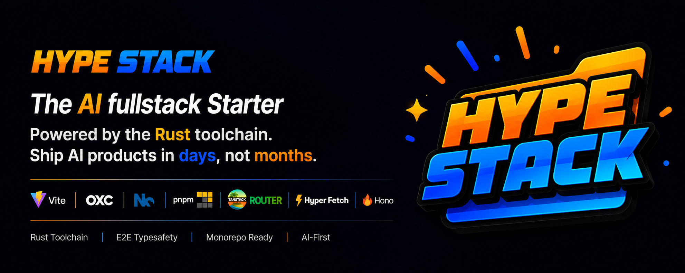

<h1 align="center">



</h1>

<h3 align="center">The starting point for web and desktop apps.<br/>Fully typed. AI-ready. Production-grade architecture.</h3>

<p align="center">
A clean, empty full-stack template.<br/>
Add the features you need, one command at a time.
</p>

<p align="center">
<a href="https://github.com/BetterTyped/hype-stack/blob/main/License.md"></a>
<a href="https://www.npmjs.com/package/@hype-stack/cli"></a>


<a href="https://github.com/BetterTyped/hype-stack/stargazers"></a>
</p>

<h3 align="center">Get started:</h3>

```bash
npx @hype-stack/cli create
```

&nbsp;

## What Is Hype Stack?

Hype Stack is a **modern full-stack template**, not a boilerplate stuffed with someone else's opinions. You get a clean, empty project with the architecture and tooling already wired up. No demo features to rip out. No dead code to clean up.

Build whatever you want from day one.

&nbsp;

## How It Works

Hype Stack follows the same model as [shadcn/ui](https://ui.shadcn.com), but for full-stack features.

1. **Scaffold** your project with the CLI.
2. **Compose** packs when you need them: auth, billing, realtime, teams, desktop layouts, and more.
3. Each pack drops production-ready code **into your codebase**. You own it, you modify it.

```bash
npx @hype-stack/cli create     # Create a new project
npx @hype-stack/cli compose    # Pick packs to add (interactive)
```

Want to script it? Skip the prompts and pass the packs directly:

```bash
npx @hype-stack/cli compose --packs starter-saas-workos,pack-collaboration
```

No lock-in. No runtime dependency. Just code in your repo.

&nbsp;

## Preview

<details open>
<summary><b>SaaS</b></summary>

<br/>

<video src="https://github.com/BetterTyped/hype-stack/raw/main/.github/demos/saas-demo.mp4" controls width="100%">
  Your browser does not support video playback.
  <a href="https://github.com/BetterTyped/hype-stack/raw/main/.github/demos/saas-demo.mp4">Download the video</a> to watch.
</video>

</details>

<details>
<summary><b>Billing</b></summary>

<br/>

<video src="https://github.com/BetterTyped/hype-stack/raw/main/.github/demos/billing-demo.mp4" controls width="100%">
  Your browser does not support video playback.
  <a href="https://github.com/BetterTyped/hype-stack/raw/main/.github/demos/billing-demo.mp4">Download the video</a> to watch.
</video>

</details>

<details>
<summary><b>Notifications</b></summary>

<br/>

<video src="https://github.com/BetterTyped/hype-stack/raw/main/.github/demos/notifications-demo.mp4" controls width="100%">
  Your browser does not support video playback.
  <a href="https://github.com/BetterTyped/hype-stack/raw/main/.github/demos/notifications-demo.mp4">Download the video</a> to watch.
</video>

</details>

&nbsp;

<p align="center">
	<a href="https://github.com/sponsors/prc5?tier=Platinum">
		<picture>
			
		</picture>
	</a>
</p>

<p align="center">
	<a href="https://github.com/sponsors/prc5?tier=Platinum">
		<picture>
			
		</picture>
	</a>
</p>

## What You Get Out of the Box

The template ships with **zero features** and **everything you need to build them**:

- **Monorepo**: frontend, backend, and shared packages in one repo.
- **End-to-end types**: the frontend imports backend contracts directly. No codegen.
- **Rust-powered tooling**: OXC lint and format, Vite 8 HMR in milliseconds.
- **AI-native structure**: vertical architecture with bundled Cursor rules and agent skills.
- **Desktop-ready**: Electron Forge pre-configured for macOS, Windows, and Linux.
- **Testing setup**: Vitest, React Testing Library, and Playwright E2E ready to go.

&nbsp;

## Available Packs

Need features? Add them with `npx @hype-stack/cli compose`. Each pack installs production-grade, fully-typed code straight into your project. Start with a starter, pick one layout, then stack on the features you want.

| Pack                      | Category | What it adds                                                                   |
| ------------------------- | -------- | ------------------------------------------------------------------------------ |
| **SaaS Starter (WorkOS)** | Starter  | Auth, organizations, roles, and sessions. Social and SSO login via WorkOS.     |
| **Basic** _(free)_        | Layout   | Classic dashboard shell: collapsible sidebar, org switcher, breadcrumb header. |
| **Native App Shell**      | Layout   | One layout for web and Electron, with mobile drawer and native window chrome.  |
| **Monetization**          | Feature  | Stripe checkout, the billing portal, subscriptions, and signed webhooks.       |
| **Collaboration**         | Feature  | Teams, projects, email invitations, and realtime presence.                     |
| **Notifications**         | Feature  | WebSocket push, an in-app inbox, and email fallback through Resend.            |

Navigation is pack-driven: install a feature pack and its links show up in the sidebar on their own.

> Premium packs need a license. Run `npx @hype-stack/cli login` to install the ones your organization owns, or pass a key with `--license-key`. The base template and free packs are open source forever.

&nbsp;

<p align="center">
	<a href="https://github.com/sponsors/prc5?tier=Gold">
		<picture>
			
		</picture>
	</a>
</p>

<p align="center">
	<a href="https://github.com/sponsors/prc5?tier=Gold">
		<picture>
			
		</picture>
	</a>
</p>

## Why Hype Stack?

### Clean slate, not a gutting job

Most templates hand you a demo app and expect you to delete half of it. Hype Stack gives you an empty project with the hard parts already solved: monorepo wiring, type bridges, tooling, and CI.

### Built for AI agents

The codebase follows a [vertical architecture](https://tkdodo.eu/blog/the-vertical-codebase). Each feature owns its routes, UI, data access, types, and tests. Bundled Cursor rules and agent skills teach LLMs exactly how to add features and follow the conventions. Fast tooling gives agents sub-second feedback loops.

### Zero-codegen type safety

No OpenAPI specs. No code generators. The frontend imports `@internal/backend` as a workspace dependency. HTTP routes and WebSocket events flow through a typed bridge, so when you change a backend response, TypeScript flags every mismatched consumer instantly.

### One codebase, every platform

The same React app runs as a web SPA and an Electron desktop app. A single `VITE_APP_TYPE` flag controls the split. Desktop builds are ready when you are.

&nbsp;

<p align="center">
	<a href="https://github.com/sponsors/prc5?tier=Silver">
		<picture>
			
		</picture>
	</a>
</p>

<p align="center">
	<a href="https://github.com/sponsors/prc5?tier=Silver">
		<picture>
			
		</picture>
	</a>
</p>

## Architecture

```
┌─────────────────────────────────────────────────┐
│                   pnpm monorepo                   │
├─────────────────┬─────────────────────────────────┤
│  apps/frontend  │  apps/backend                   │
│  ─────────────  │  ────────────                   │
│  React 19       │  Hono                           │
│  TanStack Router│  Prisma + Kysely                │
│  HyperFetch SDK │  Zod validation                 │
│  Electron Forge │  Typed WebSockets               │
│  shadcn/ui      │  WorkOS auth                    │
├─────────────────┴─────────────────────────────────┤
│  packages/enums: shared permissions and config    │
└─────────────────────────────────────────────────┘
```

&nbsp;

## Tech Stack

| Layer      | Technology                                                |
| ---------- | --------------------------------------------------------- |
| Frontend   | React 19, TanStack Router, Tailwind v4, shadcn/ui, Motion |
| Backend    | Hono, Prisma 7, Kysely, Zod                               |
| Data layer | HyperFetch SDK, typed HTTP and WebSocket bridge           |
| Desktop    | Electron Forge (macOS, Windows, Linux)                    |
| Database   | PostgreSQL 17 + pgvector                                  |
| Cache      | Valkey (Redis-compatible)                                 |
| Tooling    | Nx, Vite 8, OXC, pnpm, TypeScript 6                       |
| Monitoring | Sentry                                                    |

&nbsp;

## Quick Start

```bash
# Create a new project
npx @hype-stack/cli create

# Start infrastructure
cd apps/backend && docker compose up -d && cd ../..

# Run migrations
pnpm --filter backend exec prisma migrate deploy
pnpm --filter backend exec prisma generate

# Launch everything
pnpm dev
```

> The web app runs on Vite. The backend runs on Hono. Both hot-reload instantly.

&nbsp;

## Development

### Docker Services

```bash
cd apps/backend
docker compose up -d
```

| Service        | Port | Purpose                             |
| -------------- | ---- | ----------------------------------- |
| Postgres       | 5436 | Database (PostgreSQL 17 + pgvector) |
| Valkey         | 6381 | Cache                               |
| RustFS         | 9000 | S3-compatible object storage        |
| RustFS Console | 9001 | Storage web UI                      |

### Commands

```bash
pnpm dev              # Start frontend + backend with hot-reload
pnpm build            # Production build
pnpm lint             # OXC linting
pnpm format           # OXC formatting
pnpm typecheck        # Full type checking
pnpm test             # Run all tests
```

### Testing

```bash
cd apps/backend
pnpm test:setup       # Start test containers + migrate + generate
pnpm test             # Run tests
pnpm test:clean       # Tear down test infrastructure
```

&nbsp;

## Our Sponsors

<p align="center">
	<a href="https://github.com/sponsors/prc5">
		
	</a>
</p>

&nbsp;

---

<p align="center">
<strong>Start empty. Add what you need. Ship fast.</strong><br/><br/>
Hype Stack gives you the architecture. You choose the features.
</p>

## License

[MIT](https://github.com/BetterTyped/hype-stack/blob/main/License.md)
