<h1 align="center">

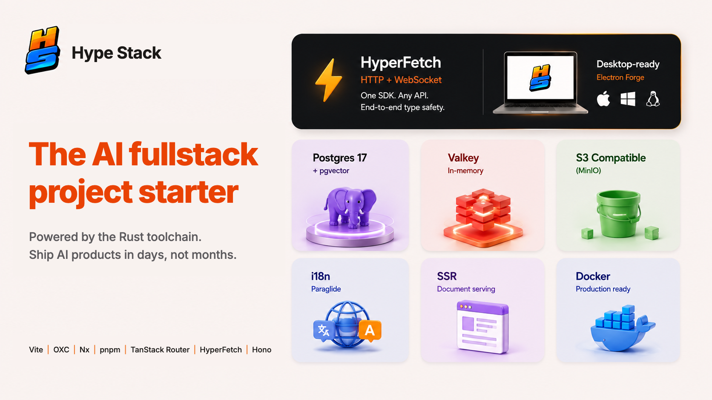

</h1>

<h3 align="center">The starting point for web, desktop, mobile and browser apps.<br/>Fully typed. AI-ready. Production-grade architecture.</h3>

<p align="center">
A clean, empty full-stack template.<br/>
Add the features you need, one command at a time.
</p>

<p align="center">
<a href="https://github.com/BetterTyped/hype-stack/blob/main/License.md"></a>
<a href="https://www.npmjs.com/package/@hype-stack/cli"></a>


<a href="https://github.com/BetterTyped/hype-stack/stargazers"></a>
</p>

<h3 align="center">Get started</h3>

```bash
npx @hype-stack/cli create
```

<h3 align="center">Connect your AI editor</h3>

```bash
npx @hype-stack/cli mcp install
```

<p align="center">
<sub>Cursor, Claude Code, Windsurf and Copilot get the CLI as MCP tools.</sub>
</p>

&nbsp;

<h2 align="center">Deploy the entire stack with one command</h2>

<p align="center">
<a href="https://www.hype-stack.dev/docs/cli/deploy">
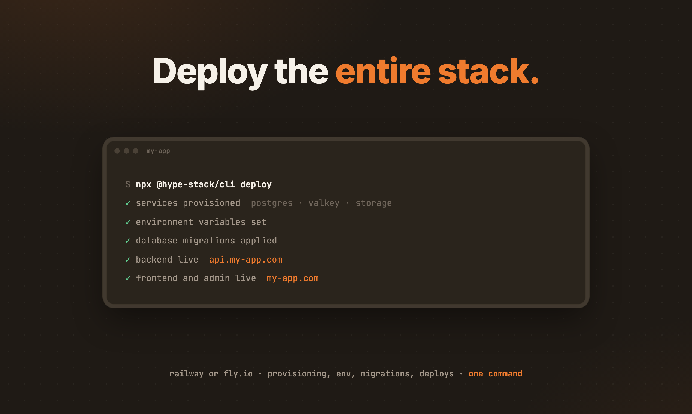
</a>
</p>

```bash
npx @hype-stack/cli deploy
```

<p align="center">
Frontend, admin, backend, Postgres, cache and storage, live on <a href="https://railway.app">Railway</a> or <a href="https://fly.io">Fly.io</a>.<br/>
Mobile builds through EAS. The extension publishes to Chrome, Edge and Firefox. <a href="https://www.hype-stack.dev/docs/cli/deploy">Deploy docs</a>
</p>

&nbsp;

## What Is Hype Stack?

Hype Stack is a **modern full-stack template**. You get a clean, empty monorepo with the architecture and tooling already wired up. No demo features to rip out. No dead code to clean up.

Features arrive when you ask for them. The CLI writes whole features into your repo as source code you own, the same way shadcn/ui does components. The same CLI deploys the whole stack when you're ready.

&nbsp;

## What You Get Out of the Box

- 🧩 **Monorepo**: frontend, admin, mobile, extension, backend and shared packages in one Nx workspace
- 🔐 **End-to-end types**: every client imports backend contracts directly. No codegen, no OpenAPI
- 🖥️ **Five clients**: web, Electron desktop, admin panel, Expo mobile app and a browser extension
- 🚀 **One-command deploy**: ship the full stack to Railway or Fly.io
- 📡 **HyperFetch SDK**: typed HTTP and WebSocket client generated from your Hono routes
- 🗄️ **Postgres + Prisma**: migrations, Kysely queries, pgvector ready
- ⏰ **Cron scheduler**: in-process jobs with exactly-once runs and catch-up after downtime
- 🌍 **i18n ready**: Paraglide wired into every app, backend responses included
- 🎨 **UI ready**: Tailwind v4 + shadcn/ui on web, NativeWind on mobile. CSR or SSR with a script switch
- ⚡ **Rust-powered DX**: OXC lint/format, React Compiler through oxc, Vite 8 HMR in milliseconds
- 🤖 **AI-native structure**: vertical features, editor rules and an MCP server for your agent
- 🧪 **Tests included**: Vitest, React Testing Library and Playwright E2E

<p align="center">
<a href="https://www.hype-stack.dev/discord">

</a>
</p>

&nbsp;

<p align="center">
	<a href="https://github.com/sponsors/prc5?tier=Platinum">
		<picture>
			
		</picture>
	</a>
</p>

<p align="center">
	<a href="https://github.com/sponsors/prc5?tier=Platinum">
		<picture>
			
		</picture>
	</a>
</p>

## How It Works

Hype Stack follows the same model as [shadcn/ui](https://ui.shadcn.com), but for full-stack features.

```bash
npx @hype-stack/cli create      # 1. Scaffold the empty monorepo
npx @hype-stack/cli compose     # 2. Pick feature packs, get source code in your repo
npx @hype-stack/cli deploy      # 3. Ship everything to Railway or Fly.io

# Also
npx @hype-stack/cli template    # Start from a curated template (wizard)
npx @hype-stack/cli community   # Scaffold, validate and install packs anyone wrote
npx @hype-stack/cli mcp install # Give your AI editor the same commands as tools
```

No lock-in. No runtime dependency. Just code in your repo. Every command is documented in the [CLI docs](https://www.hype-stack.dev/docs/cli).

&nbsp;

## Use Feature Packs. Or Build Your Own.

<p align="center">
<a href="https://www.hype-stack.dev/packs">
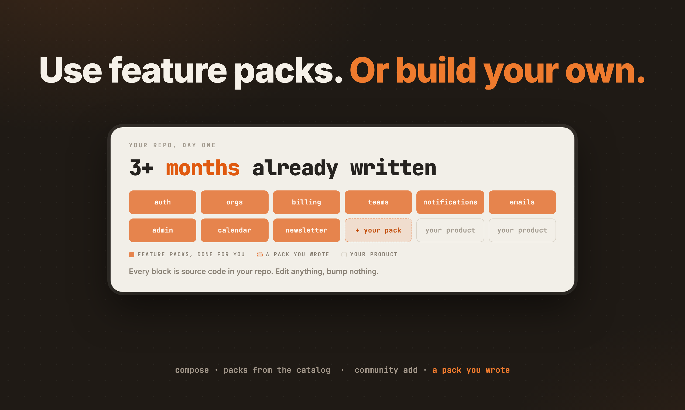
</a>
</p>

A pack covers every layer at once: routes, Prisma models, webhook handlers, frontend pages, admin views, emails and translations. Navigation, env vars and permissions are declared in the pack manifest and patched in by the CLI. From that point it's your code.

| Pack | What lands in your repo |
| --- | --- |
| **SaaS Starter** | Auth (Better Auth or WorkOS), organizations, roles, sessions, admin views |
| **Layouts** | Basic (free), Glass, Joyful, Native App Shell |
| **Billing** | Stripe, Lemon Squeezy or Polar. Checkout, portal, webhooks, subscription admin |
| **Teams, Projects** | Memberships, invites, role checks on every route, boards and tasks |
| **Notifications, Newsletter** | WebSocket push, in-app inbox, email fallback, campaigns, subscribers |
| **Calendar, Whiteboard** | Scheduling and a realtime collaborative canvas |
| **Cookie Consent** | Banner and preferences. Free |

<p align="center">
<a href="https://www.hype-stack.dev/packs"><b>Browse packs</b></a> ·
<a href="https://www.hype-stack.dev/docs/cli/add-pack"><b>Adding a pack</b></a> ·
<a href="https://www.hype-stack.dev/build-your-own"><b>Write your own pack</b></a> ·
<a href="https://www.hype-stack.dev/docs/packs-templates/pack-manifest"><b>Manifest reference</b></a>
</p>

> 🔑 Premium packs need a license. Run `npx @hype-stack/cli login` to install the ones your organization owns. The base template, the Basic layout and the Cookie Consent pack are open source forever.

&nbsp;

## Start From Our Project Templates

A template is a curated bundle of packs plus its own landing page, theme and branding.

```bash
npx @hype-stack/cli template open-calendar
```

<table>
<tr>
<td width="50%" align="center">
<a href="https://www.hype-stack.dev/templates/better-studio">
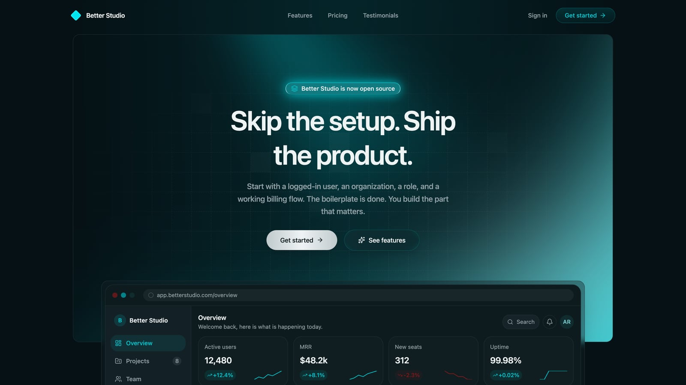
</a>
<br/>
<a href="https://www.hype-stack.dev/templates/better-studio"><b>Better Studio</b></a><br/>
<sub>Auth, billing and an app shell</sub>
</td>
<td width="50%" align="center">
<a href="https://www.hype-stack.dev/templates/open-calendar">
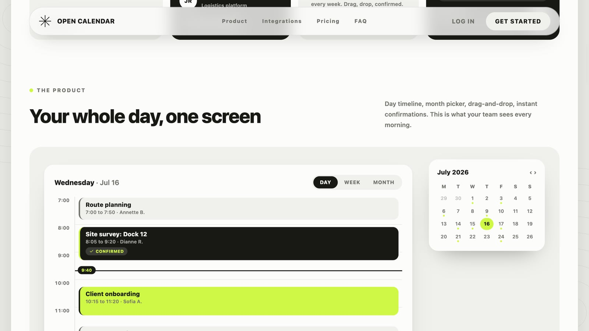
</a>
<br/>
<a href="https://www.hype-stack.dev/templates/open-calendar"><b>Open Calendar</b></a><br/>
<sub>Scheduling and calendar</sub>
</td>
</tr>
<tr>
<td width="50%" align="center">
<a href="https://www.hype-stack.dev/templates/aether">
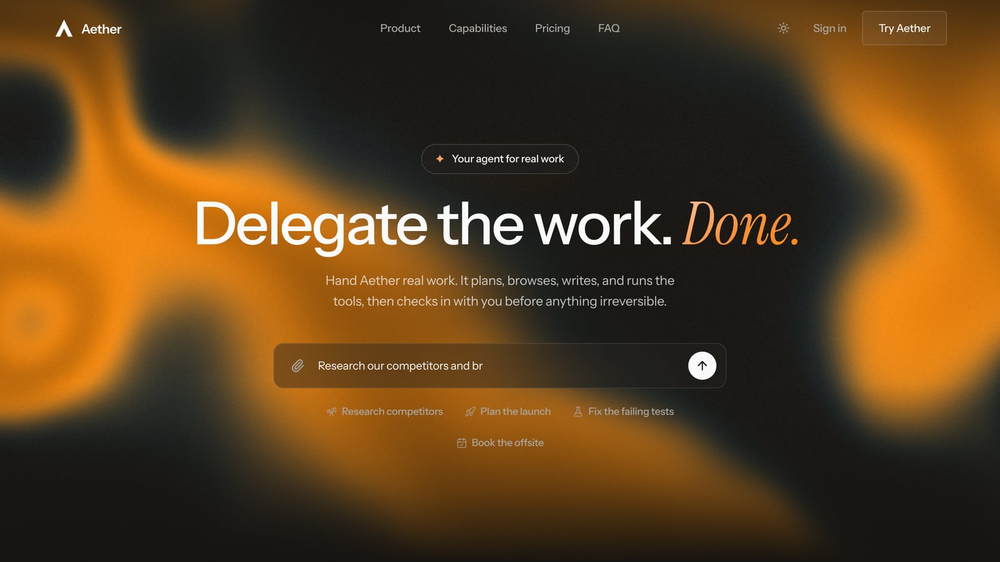
</a>
<br/>
<a href="https://www.hype-stack.dev/templates/aether"><b>Aether</b></a><br/>
<sub>AI agent chat</sub>
</td>
<td width="50%" align="center">
<a href="https://www.hype-stack.dev/templates/vault">
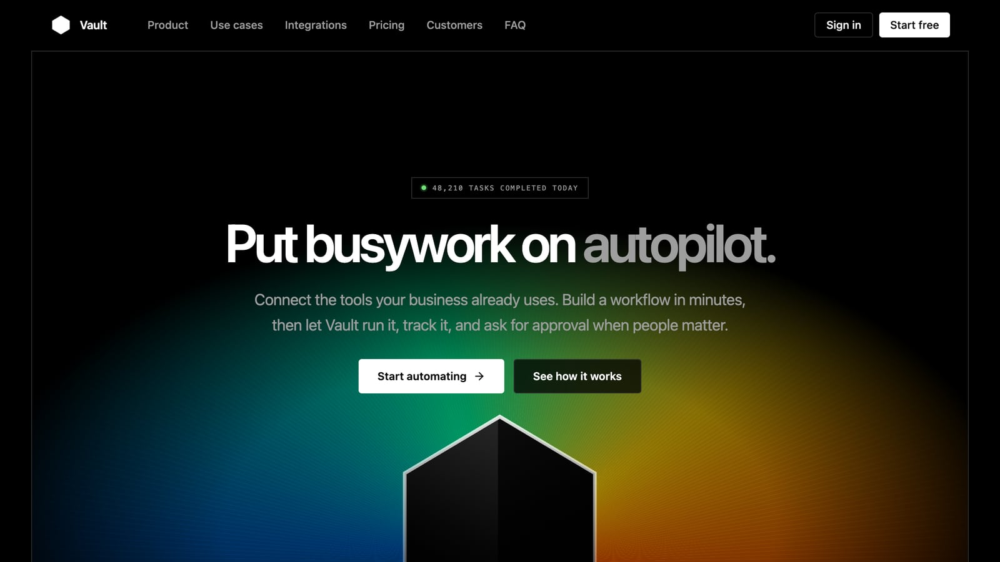
</a>
<br/>
<a href="https://www.hype-stack.dev/templates/vault"><b>Vault</b></a><br/>
<sub>Workflow automation</sub>
</td>
</tr>
<tr>
<td width="50%" align="center">
<a href="https://www.hype-stack.dev/templates/mind-map">
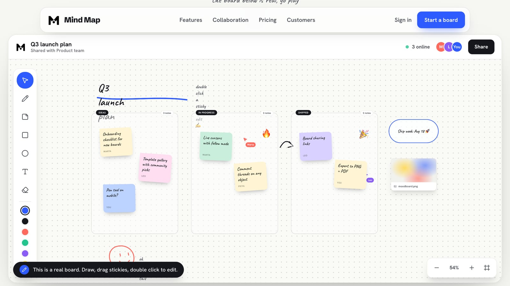
</a>
<br/>
<a href="https://www.hype-stack.dev/templates/mind-map"><b>Mind Map</b></a><br/>
<sub>Collaborative whiteboard</sub>
</td>
<td width="50%" align="center">
<a href="https://www.hype-stack.dev/templates/indie-hacker">
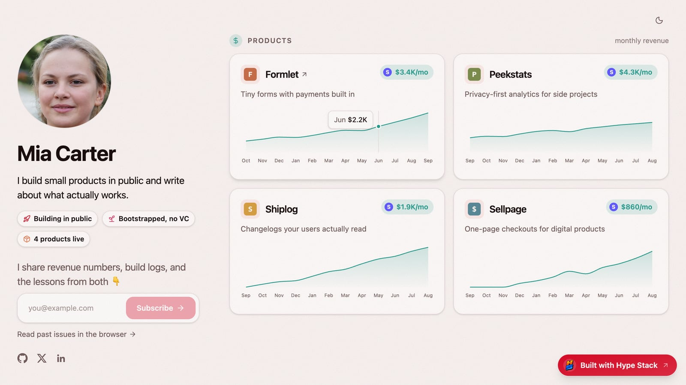
</a>
<br/>
<a href="https://www.hype-stack.dev/templates/indie-hacker"><b>Indie Hacker Portfolio</b></a><br/>
<sub>Portfolio with live revenue and a newsletter</sub>
</td>
</tr>
</table>

<p align="center">
<a href="https://www.hype-stack.dev/templates"><b>All templates</b></a>
</p>

&nbsp;

<p align="center">
	<a href="https://github.com/sponsors/prc5?tier=Gold">
		<picture>
			
		</picture>
	</a>
</p>

<p align="center">
	<a href="https://github.com/sponsors/prc5?tier=Gold">
		<picture>
			
		</picture>
	</a>
</p>

## Built for AI Agents

<p align="center">
<a href="https://www.hype-stack.dev/mcp">
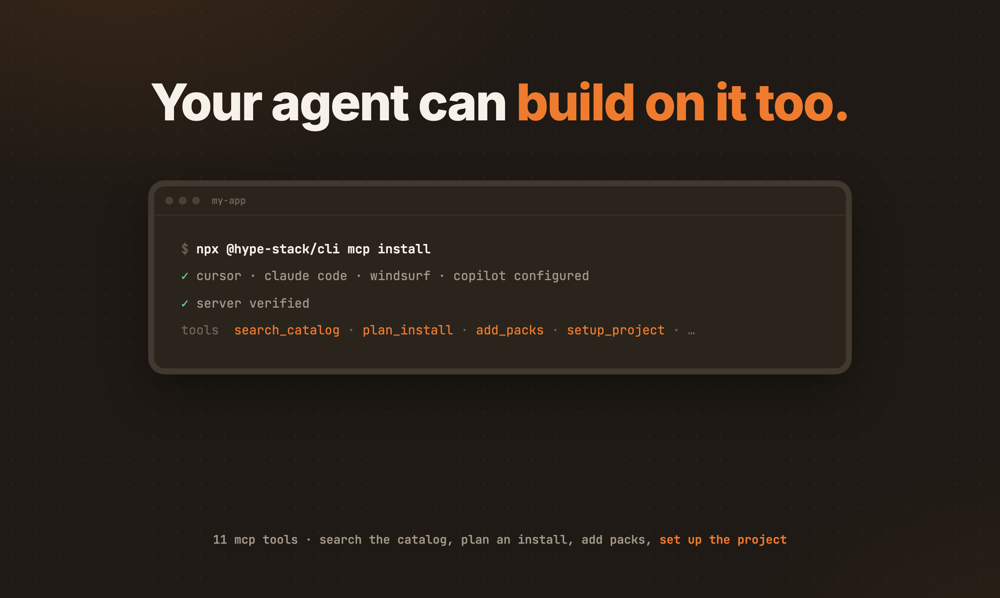
</a>
</p>

The codebase follows a [vertical architecture](https://tkdodo.eu/blog/the-vertical-codebase): each feature owns its routes, UI, data access, types and tests. `create` writes rules for the editor you pick, and the CLI runs as an MCP server so your agent can search the catalog, plan an install, add packs and set up the project. [MCP docs](https://www.hype-stack.dev/docs/cli/mcp)

&nbsp;

## One Backend, Five Clients

<p align="center">
<a href="https://www.hype-stack.dev/application">
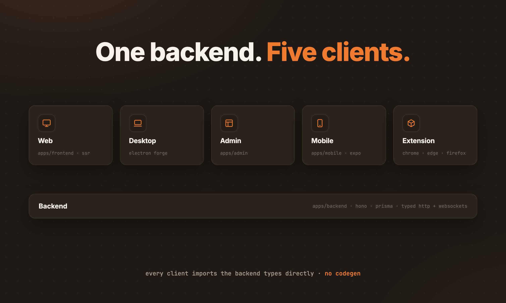
</a>
</p>

Every client imports `@internal/backend` as a workspace dependency. Change a response shape and every consumer fails typecheck before it fails in production.

| Layer      | Technology                                                |
| ---------- | --------------------------------------------------------- |
| Frontend   | React 19, TanStack Router, Tailwind v4, shadcn/ui, Motion |
| Admin      | Same stack as the frontend, its own theme and deploy      |
| Mobile     | Expo SDK 57, Expo Router, NativeWind                      |
| Extension  | Vite build for Chrome, Edge and Firefox                   |
| Desktop    | Electron Forge (macOS, Windows, Linux)                    |
| Backend    | Hono, Prisma 7, Kysely, Zod, croner, Resend               |
| Data layer | HyperFetch SDK, typed HTTP and WebSocket bridge           |
| Database   | PostgreSQL 17 + pgvector                                  |
| Cache      | Valkey (Redis-compatible)                                 |
| Tooling    | Nx 23, Vite 8, OXC, pnpm 12, TypeScript 6                 |
| Monitoring | Sentry                                                    |

&nbsp;

<p align="center">
	<a href="https://github.com/sponsors/prc5?tier=Silver">
		<picture>
			
		</picture>
	</a>
</p>

<p align="center">
	<a href="https://github.com/sponsors/prc5?tier=Silver">
		<picture>
			
		</picture>
	</a>
</p>

## Development

`create` starts Docker and runs the first migration for you. If you cloned the repo by hand:

```bash
cd apps/backend && docker compose up -d && cd ../..                   # Postgres, Valkey, RustFS
pnpm --filter ./apps/backend exec prisma migrate dev --name init      # initial migration
pnpm dev                                                              # every app, hot-reload
```

| Service        | Port | Purpose                             |
| -------------- | ---- | ----------------------------------- |
| Postgres       | 5436 | Database (PostgreSQL 17 + pgvector) |
| Valkey         | 6381 | Cache                               |
| RustFS         | 9000 | S3-compatible object storage        |
| RustFS Console | 9001 | Storage web UI                      |

```bash
pnpm build            # Production build
pnpm lint             # OXC linting
pnpm format           # OXC formatting
pnpm typecheck        # Full type checking
pnpm test             # Run all tests (backend: pnpm test:setup first)
```

Full setup, environment variables and troubleshooting live in the [docs](https://www.hype-stack.dev/docs).

&nbsp;

## Why Hype Stack?

**🧹 Clean slate, not a gutting job.** Most templates hand you a demo app and expect you to delete half of it. Hype Stack gives you an empty project with the hard parts already solved: monorepo wiring, type bridges, tooling and CI.

**📦 Features you own.** A pack is source in your repo, not a dependency you configure. When billing needs to behave differently, you change the file instead of fighting a library. Every install is a diff you can read in git before you commit.

**🛡️ Zero-codegen type safety.** No OpenAPI specs, no generators. Change a backend response and TypeScript flags every mismatched consumer across web, desktop, admin, mobile and extension.

**🤖 Built for AI agents.** Vertical features, editor rules written on `create`, and an MCP server so your agent works with the same commands you do.

&nbsp;

## Our Sponsors

<p align="center">
	<a href="https://github.com/sponsors/prc5">
		
	</a>
</p>

&nbsp;

---

<p align="center">
<strong>Start empty. Add what you need. Ship fast.</strong><br/><br/>
Hype Stack gives you the architecture. You choose the features.
</p>

## License

[MIT](https://github.com/BetterTyped/hype-stack/blob/main/License.md)
